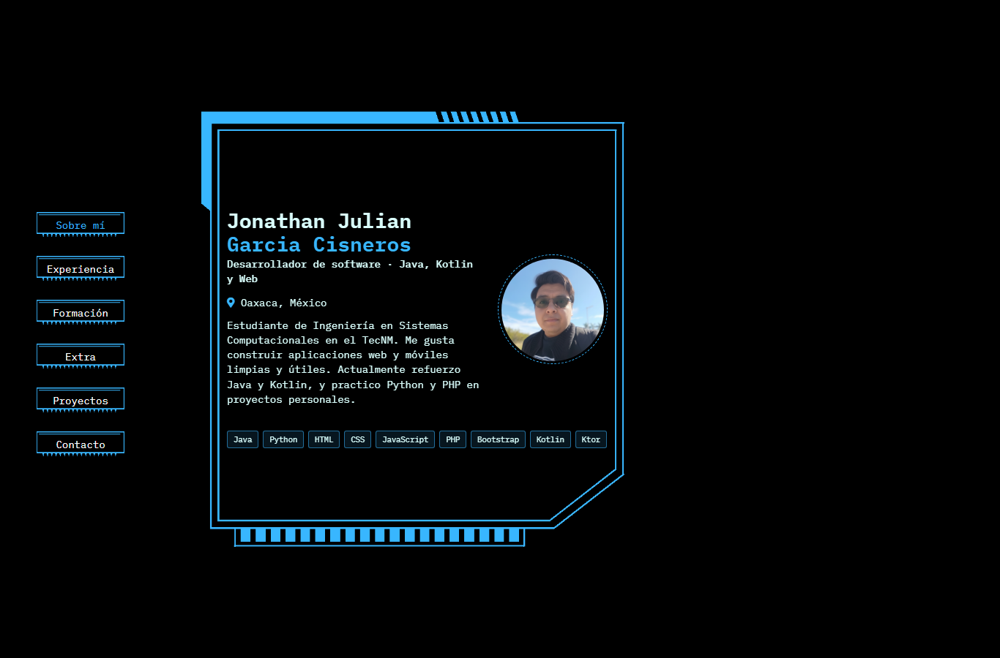

# Portafolio | Jonathan Julian Garcia Cisneros

Portafolio personal e interactivo para presentar mi perfil como desarrollador de software, mis tecnologías, experiencia, formación y proyectos.

## Enlaces

- **Repositorio:** [github.com/LianDev1/Actividad4](https://github.com/LianDev1/Actividad4)
- **GitHub Pages:** [liandev1.github.io/Actividad4](https://liandev1.github.io/Actividad4/)
- **Plantilla y código de referencia:** [Repositorio Actividad4](https://github.com/LianDev1/Actividad4)

## Plantilla y tecnologías

La interfaz conserva la plantilla de portafolio interactivo en forma de cubo 3D que se eligió para esta versión. Cada cara presenta una sección distinta y se activa desde el menú. El contenido fue adaptado a partir de los datos del portafolio de la actividad anterior.

- **Estructura:** HTML5.
- **Estilos:** CSS propio en `css/style.css`, con transformaciones 3D y reglas responsivas.
- **Interacción:** JavaScript nativo en `js/js.js`; no se usan frameworks de JavaScript.
- **Iconos:** Font Awesome cargado desde CDN.

## Secciones

| Sección | Contenido |
| --- | --- |
| Sobre mí | Nombre, perfil profesional, ubicación, presentación personal y tecnologías. |
| Experiencia | Apoyo en el Centro de Cómputo del Instituto Tecnológico de Oaxaca y proyecto de servicio social en curso. |
| Formación | Ingeniería en Sistemas Computacionales y cursos de Java, Python, desarrollo web, PHP/MySQL y Kotlin. |
| Extra | ExpoProyectos, club de programación y voluntariado tecnológico. |
| Proyectos | Sistema de inventario, aplicación Android de tareas y API de biblioteca. Son proyectos de ejemplo o planeados; no se muestran enlaces de demostración inexistentes. |
| Contacto | Correo electrónico, ubicación, GitHub y LinkedIn. |

## Estructura del proyecto

```text
Actividad4_nueva/
├── index.html
├── README.md
├── css/
│   └── style.css
├── js/
│   └── js.js
└── img/
    ├── Foto_perfil.png
    └── capturas/
        └── portada.png
```

## Proceso de creación

1. Se partió de la plantilla interactiva de cubo 3D que ya estaba en el proyecto https://freefrontend.com/html-resume-templates/#2024-01-02-3d-cube-resume-with-css-transforms-l.
2. Se conectaron `index.html`, `css/style.css` y `js/js.js` para cargar correctamente la página y sus interacciones.
3. Se reemplazó el perfil de ejemplo por el nombre, la foto, la ubicación, el correo y los enlaces de mis perfiles.
4. Se organizaron las tecnologías, experiencia, formación, actividades y proyectos en las seis caras disponibles.
5. Se adaptaron los estilos para pantallas pequeñas y se sincronizó el estado accesible de los botones de navegación.
6. Se probaron las seis secciones en escritorio y móvil, y se guardaron capturas de la página funcionando.

## Captura de pantalla

Portada del portafolio funcionando en Edge a 1366 × 900.

